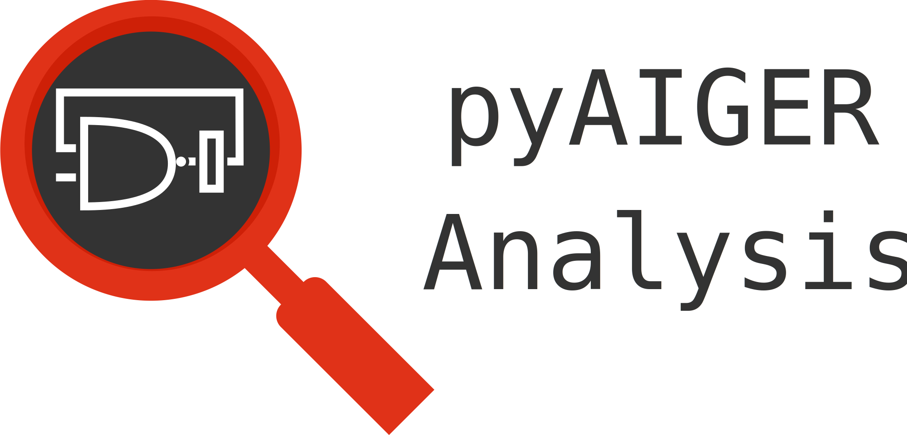

<figure>
  
  <figcaption>pyAiger-Analysis: Tools for analyzing aiger
  circuits.</figcaption>
</figure>

[](https://travis-ci.org/mvcisback/py-aiger-analysis)
[](https://codecov.io/gh/mvcisback/py-aiger-analysis)
[](https://pyup.io/repos/github/mvcisback/py-aiger-analysis/)

[](https://pypi.python.org/pypi/py-aiger-analysis/)
[](https://pypi.python.org/pypi/py-aiger-analysis//)


# Table of Contents
- [About](#about-py-aiger-analysis)
- [Installation](#installation)
- [Using PAA](#using-py-aiger-analysis)

# About Py-Aiger-Analsysis

This library enables the convenient use of SAT solvers and QBF solvers for the analysis of [py-aiger](https://github.com/mvcisback/py-aiger) circuits.
This README assumes basic familiarity with py-aiger, please check out the documentation.


# Installation

One can install via pip:

`$ pip install py-aiger-analysis[SAT,BDD]`

or without BDD support:

`pip install py-aiger-analysis[SAT]`

or without BDD or SAT support:

`pip install py-aiger-analysis`

## Developer install
Clone respository and execute:

`$ python setup.py develop`

## Additional Requirements


This package currently assumes [CADET](https://github.com/MarkusRabe/cadet), [ABC](https://github.com/berkeley-abc/abc), and [aigtoaig](http://fmv.jku.at/aiger/) installed in the PATH.

We plan to release a version on PIP, including all required tools.

# Using Py-Aiger-Analysis

The library is currently intended to use with py-aiger expressions.

```python
import aiger_analysis as aa
import aiger

x, y = aiger.atom('x'), aiger.atom('y')
expr = x & y
```

## SAT solver interface via python-sat. Install with SAT option.
```python
# Call a SAT solver to check if there is a satisfying assignment.
`assert aa.is_satisfiable(expr)`

# Check if all assignments are satisfying, using a satsolver.
`assert not aa.is_valid(expr)`

# Check if two expressions are equal, using a satsolver.
`assert aa.is_equal(expr, aa.simplify(expr))`
```

## BDD interface:

```python
# One can convert a boolean expression to a bdd via:
f, manager, relabels = aa.to_bdd(expr) 

# or given an aiger circuit, one can convert to a bdd by specifying the output.
# If the aiger circuit only has one output, the output does not need to be
# specificed.

f, manager, relabels = aa.to_bdd(expr.aig, output=expr.output)

# f is now a bdd expression and manager is the bdd manager. 

# Because aiger supports a larger set of names than the dd package,
# the inputs of the expression are relabeled to names given by the
# bidict relabels.

# One can convert back to an aiger boolean expression via:
expr2 = aa.from_bdd(f)

# We currently also implement counting the number of satisifying solutions using BDDs.
# This is done by first converting an expression to a bdd and the using the bdd's count
# primative.
c = aa.count(expr, percent=True)
```

## QBF solver interface via 
```python
'''
 Call the QBF solver CADET to check if this QBF is true. The second argument
 indicates the quantifier prefix: 'a' stands for universal quantifiers, 'e' for
 existential quantifiers. Each quantifier indicates a list of bound variables.
 All variables of the expression must be bound by some quantifier.
'''
assert not aa.is_true_QBF(expr, [('a', ['x']), ('e', ['y'])])

'''
 Call CADET to eliminate a given list of variables from the expression. The
 resulting expression is a formula over the remaining variables that is true
 if, and only if, there is a satisfying assignment to the indicated variables.
'''
also_x = aa.eliminate(expr, ['y'])
assert aa.is_equal(x, also_x)
```

Currently there is limited support for general py-aiger circuits. The library does not accept circuits with latches and circuits with more than a single output. 
To use the library with expressions from aiger-bv, please extract such an aiger circuit.
